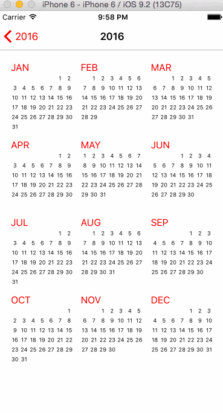

# Challenge 4
## Custom Navigation Transition



iOS7 opened up a new world of custom transitions and animations, and the stock Calendar app is a great example of what's possible. For this challenge, we'll attempt to recreate the Calendar app's "zoom" transition from its year view to its month view.

## Assets
Clone this repo and use the sample Calendar app as a starter project. Optionally, flex your coding muscles and build this from scratch!

## Instructions
Creating a custom navigation transition is similar to creating a [custom modal transition](https://guides.codepath.com/ios/Creating-a-Custom-Modal-Transition).

Your view controller must conform to the `UINavigationControllerDelegate` protocol. It must also implement the following method:

```
func navigationController(navigationController: UINavigationController,
	animationControllerForOperation operation: UINavigationControllerOperation,
	fromViewController fromVC: UIViewController,
	toViewController toVC: UIViewController) -> UIViewControllerAnimatedTransitioning? {
		return YourCustomTransitionAnimationClass()
}
```

Like custom modal transitions, your custom transition animation class should be an `NSObject` conforming to the `UIViewControllerAnimatedTransitioning` protocol, and implement the following methods:

```
func transitionDuration(transitionContext: UIViewControllerContextTransitioning?)-> NSTimeInterval {
	  return 1.0
}

func animateTransition(transitionContext: UIViewControllerContextTransitioning) {
	// Magic happens here
}
```

## Requirements
* [ ] Implement the zoom transition from the year view to the month view
* [ ] Implement the reverse transition from the month view to the year view

## Optionals
* [ ] The Month label should seamlessly move from the year view to the month view (like Keynote's Magic Move)
* [ ] Implement a two-finger gesture that allows transitioning between year and month views by pinching or expanding
* [ ] Create the week view
* [ ] Implement the animation from the month view to the week view

## Resources
* [obj-c.io article on custom animations](https://www.objc.io/issues/5-ios7/view-controller-transitions/) (written for objective-c, but still useful)
* [More recent Swift tutorial from Ray Wenderlich](http://www.raywenderlich.com/86521/how-to-make-a-view-controller-transition-animation-like-in-the-ping-app)
* [Apple's documentation on custom navigation controller transitions](https://developer.apple.com/library/ios/documentation/UIKit/Reference/UINavigationControllerDelegate_Protocol/#//apple_ref/doc/uid/TP40007662-CH3-SW8)
* [Putting a collectionView inside a tableView cell](https://ashfurrow.com/blog/putting-a-uicollectionview-in-a-uitableviewcell-in-swift/) (we're putting a collectionView inside a collectionView item, but the concept is similar)